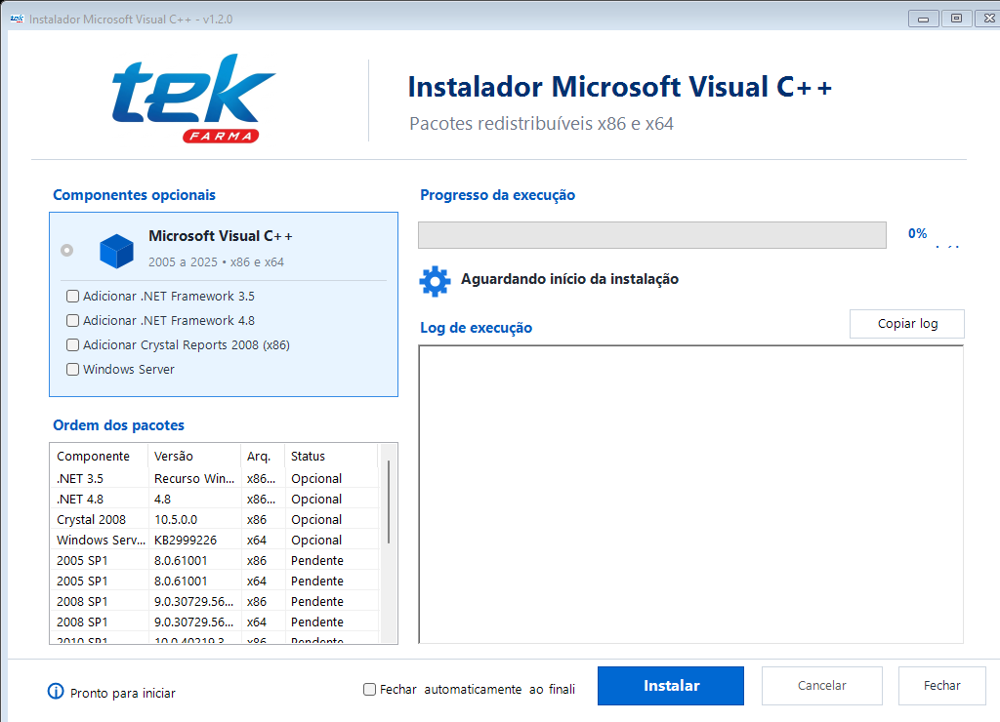

# Instalador Microsoft Visual C++

Instalador gráfico para preparar computadores que precisam executar sistemas antigos ou atuais desenvolvidos com Microsoft Visual C++. Ele centraliza os redistribuíveis x86 e x64 em uma única tela e executa os pacotes na ordem correta.



## O problema que ele resolve

Aplicações legadas podem depender simultaneamente de várias gerações do Visual C++ Redistributable. Instalar somente o pacote mais recente nem sempre resolve, pois as versões 2013 e anteriores permanecem lado a lado no Windows.

Este projeto evita a procura e a execução manual de cada instalador. Ele:

- processa os anos do mais antigo para o mais recente;
- instala sempre o pacote x86 antes do x64;
- ignora automaticamente x64 quando o Windows é 32 bits;
- usa pacotes locais ou cache quando disponíveis;
- baixa da Microsoft os pacotes que estiverem ausentes;
- executa as instalações silenciosamente e sem reinicialização automática;
- mostra progresso, status individual e log de erros;
- reconhece os códigos de sucesso, versão já instalada e reinicialização pendente.

## Componentes opcionais

As opções abaixo só são processadas quando o respectivo checkbox estiver marcado:

- **.NET Framework 3.5:** habilita o recurso `NetFx3` pelo DISM. No Windows 11 26H1, usa o instalador independente oficial da Microsoft.
- **.NET Framework 4.8:** verifica primeiro o Registro do Windows e baixa o instalador offline oficial somente quando necessário.
- **Crystal Reports 2008 Runtime x86:** garante o `.NET Framework 3.5`, remove registros anteriores do produto, faz uma instalação limpa do `CRRedist2008_x86.msi`, confirma a DLL `CrystalDecisions.CrystalReports.Engine` versão `10.5.3700.0` no GAC e executa um reparo do MSI se ela estiver ausente.
- **Windows Server:** instala silenciosamente `Windows8.1-KB2999226-x64.msu` pelo `wusa.exe`. Antes da execução, habilita e inicia o serviço Windows Update e interrompe a operação quando existe atualização aguardando reinicialização.

O MSI do Crystal é validado antes da execução pelo SHA-256 `867267BBCCE888970B5633A8C527F286D80F026FBB72E63608032872D81D6257`.
Após a instalação, o caminho esperado é `%WINDIR%\assembly\GAC_MSIL\CrystalDecisions.CrystalReports.Engine\10.5.3700.0__692fbea5521e1304\CrystalDecisions.CrystalReports.Engine.dll`.
Ao corrigir o Crystal, o instalador habilita o `NetFx3` com `dism /online /enable-feature /featurename:NetFx3 /all /norestart`. Logs detalhados do Windows Installer são gravados na Área de Trabalho.
O MSU da Microsoft é validado pelo SHA-256 `9F707096C7D279ED4BC2A40BA695EFAC69C20406E0CA97E2B3E08443C6381D15`.

## Ordem de instalação

1. 2005 SP1 — x86, x64
2. 2008 SP1 — x86, x64
3. 2010 SP1 — x86, x64
4. 2012 Update 4 — x86, x64
5. 2013 — x86, x64
6. 2015–2025 (v14) — x86, x64

## Executar

Abra o PowerShell e execute:

```powershell
[Net.ServicePointManager]::SecurityProtocol = 3072
irm https://github.com/Nata-Felix/instalador-vs-redist/releases/download/v1.3.0/install.ps1 | iex
```

O script baixa a interface e os pacotes disponíveis na release. Quando um redistribuível não está incluído na release, a própria interface usa o endereço oficial da Microsoft.

## Pacotes locais

O executável procura primeiro a pasta `packages` ao seu lado e depois o cache `%TEMP%\VisualCppInstaller_Cache`.

Nomes reconhecidos:

- `vc2005_x86.exe` / `vc2005_x64.exe`
- `vc2008_x86.exe` / `vc2008_x64.exe`
- `vc2010_x86.exe` / `vc2010_x64.exe`
- `vc2012_x86.exe` / `vc2012_x64.exe`
- `vc2013_x86.exe` / `vc2013_x64.exe`
- `vc14_x86.exe` / `vc14_x64.exe`
- `CRRedist2008_x86.msi`
- `Windows8.1-KB2999226-x64.msu`

## Compilar

Execute no PowerShell:

```powershell
.\gui\build.ps1
```

O compilador C# do .NET Framework gera `VisualCppInstaller.exe` na raiz do projeto. O manifesto solicita privilégios administrativos, necessários para instalar os redistribuíveis.

## Observações

- Os redistribuíveis antigos não têm mais suporte da Microsoft, mas podem continuar necessários para aplicações legadas.
- Códigos de saída `0`, `1638`, `3010`, `1641`, `2359301` e `2359302` são tratados como resultados válidos.
- Os códigos `3010`, `1641` e `2359301` indicam que o Windows precisa ser reiniciado.
- Os instaladores são distribuídos pela Microsoft; este projeto apenas automatiza download e execução.
